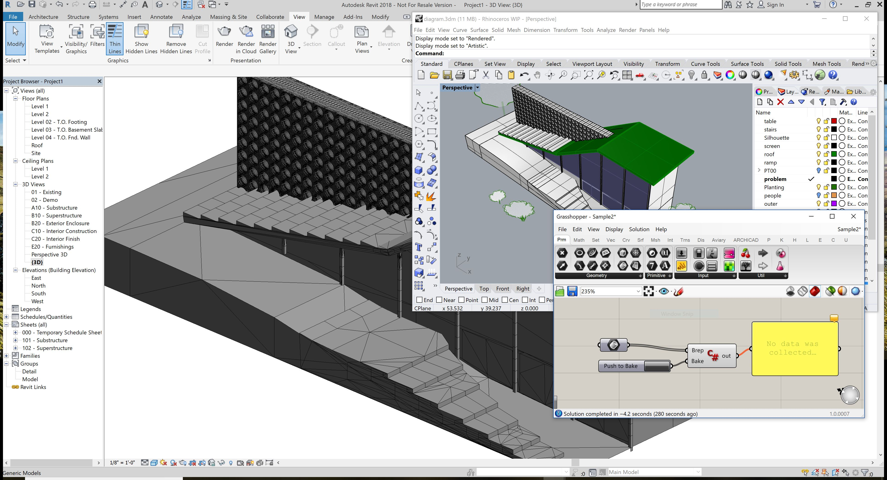

# Rhino Inside Revit
The Rhino Inside technology allows Rhino and Grasshopper to be embedded within other products.

This folder contains a Rhino inside Revit sample project that demonstrates:

1. Starting Rhino and Grasshopper as a Revit Addon.
2. Grasshopper definitions can be opened and previewed in Rhino.
3. Geometry from Rhino and Grasshopper can be pushed into Revit.



## Getting started
These instructions will get you a copy of the project up and running on your local machine for development and testing purposes.
### Prerequisites
1. Git client. ([download](https://git-scm.com/downloads))
2. Visual Studio 2017 ([download](https://visualstudio.microsoft.com/downloads/))
3. Rhino WIP ([download](https://www.rhino3d.com/download/rhino/wip))
4. Autodesk Revit 2017-2019 ([download](https://www.autodesk.com/products/revit/free-trial))

### Getting Source & Build
1. Clone the repository. At the command prompt, enter the following command:
```
git clone --recursive https://github.com/mcneel/rhino.inside.git rhino.inside
```
2. In Visual Studio: open _rhino.inside\Autodesk\Revit\RhinoInside.Revit.sln_.
3. Set the Solution Configuration drop-down according the Revit version you have installed. This will properly link the correct Revit API libraries to the project.
4. Navigate to _Build_ > _Build Solution_ to begin your build.

### Installing & Uninstalling
The project is configured to copy .addon file as well as output files to the folder _"%APPDATA%\\Autodesk\\Revit\\Addins\\%RevitVer%\\RhinoInside.Revit\\"_ folder in order to make Revit load this addon next time it runs.

In order to uninstall it you can use Visual Studio _Build_ > _Clean Solution_ command or just navigate to the folder _"%APPDATA%\\Autodesk\\Revit\\Addins\\%RevitVer%\\_ and remove the file _RhinoInside.Revit.addon_ and the folder _RhinoInside.Revit_.

## Using the samples
* Once you launch Revit it will warn you this addon is not verified, please click on "Load allways" or "Load once".
* Create a new project or open an existing one.
### Sample1
1. Open the ribbon tab called _Add-Ins_.
2. Click on the button you will found on the _Rhinoceros_ panel called _Sample 1_.
3. You should have an sphere in the Revil model.
### Sample2
1. Rhino window will open on top of Revit window.
2. Create some breps in Rhino. (It is best if they are building size objects to start.)
3. Run _Grasshopper_ command.
4. Open _"%APPDATA%\\Autodesk\\Revit\\Addins\\%RevitVer%\\RhinoInside.Revit\\Sample2.ghx"_ file in Grasshopper.
5. Inside Grasshopper using the _Brep_ param pick the breps you created in step 2.
6. Inside Grasshopper click on the button _Push to Bake_.
7. You should have the breps created in step 2 in the Revit model.
