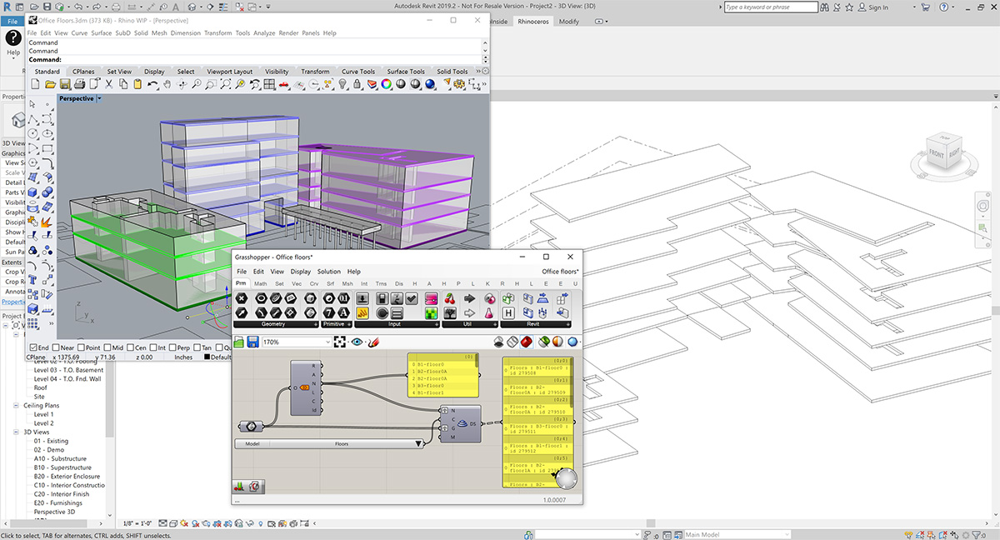
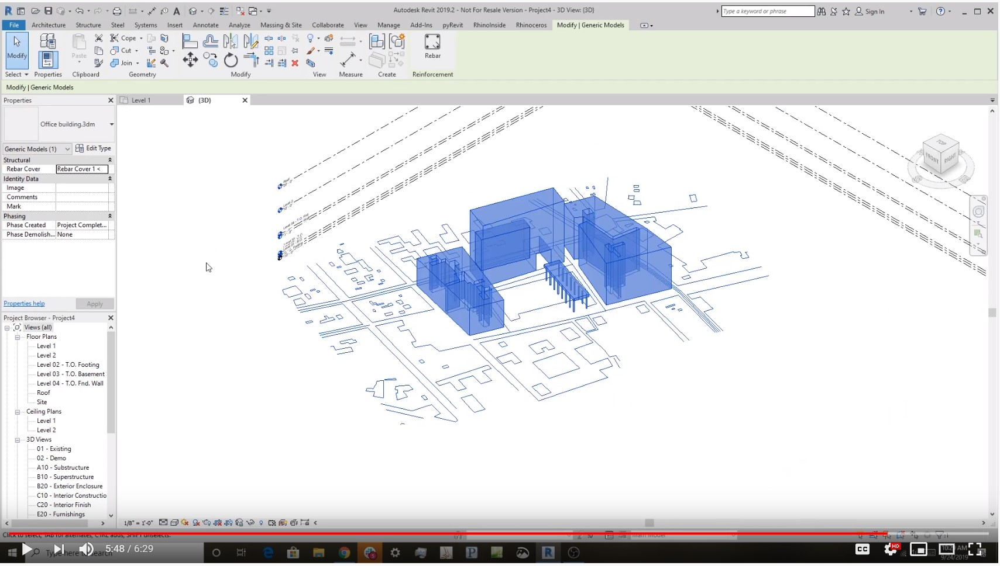
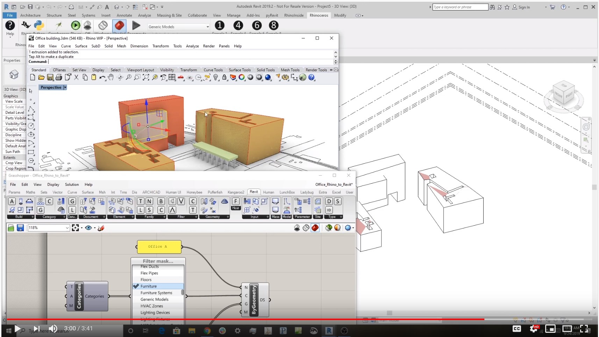

# Rhino Inside Revit

The Rhino Inside® technology allows Rhino and Grasshopper to be embedded within other products.  In this case we are running Rhino inside Revit.

This folder contains a project that demonstrates:

1. Grasshopper definitions can be opened within the Revit.
3. Includes a Revit Toolbar in Grasshopper with Revit specific components
3. Object can be natively created by Rhino or Grasshopper within Revit.\
4. Starting Rhino, Grasshopper and the Rhino.Python Editor as a Revit Addon.
2. Call directly into the native Revit APIs from a Grasshopper or Rhino plugin.

[**Questions?** *Visit the discussion forum...*](https://discourse.mcneel.com/c/rhino-inside/Revit)

*For developers looking to contribute to or customize this open source project go to the [build from source instructions](build-source.md).*

## Getting started
### Installing

To get Rhino.Inside.Revit there are 3 required applications installed in this order:

1. Revit 2017 - 2020
2. Install the [Rhino 7 WIP](https://www.rhino3d.com/download/rhino/wip) .  This requires a Rhino 6 license to download.
3. Download the **[latest RIR installer](https://www.rhino3d.com/download/rhino.inside-revit/7/wip)** and install it.

### Uninstalling
The installer copies the necessary files to the _"%APPDATA%\\Autodesk\\Revit\\Addins\\<revit_version>\\"_ folder (for each supported version). Restart Revit to load the add-on.

To uninstall, open _Programs and Features_, select "RhinoInside.Revit" and click "Uninstall".

## Tutorials and Samples

### Using Rhino Geometry in Revit

This sample shows how to take normal Rhino breps, curves and points into Revit.

### Writing a Combined Python Script

1. Use the _Python_ icon into the Add-Ins tab to open Rhino Python editor window.
2. Load pyhthon script file called _"Sample7.py"_ there is in this folder.
3. Click on the green play button you will found on the Pyhton script editor window.
4. You should have an sphere in the Revil model.