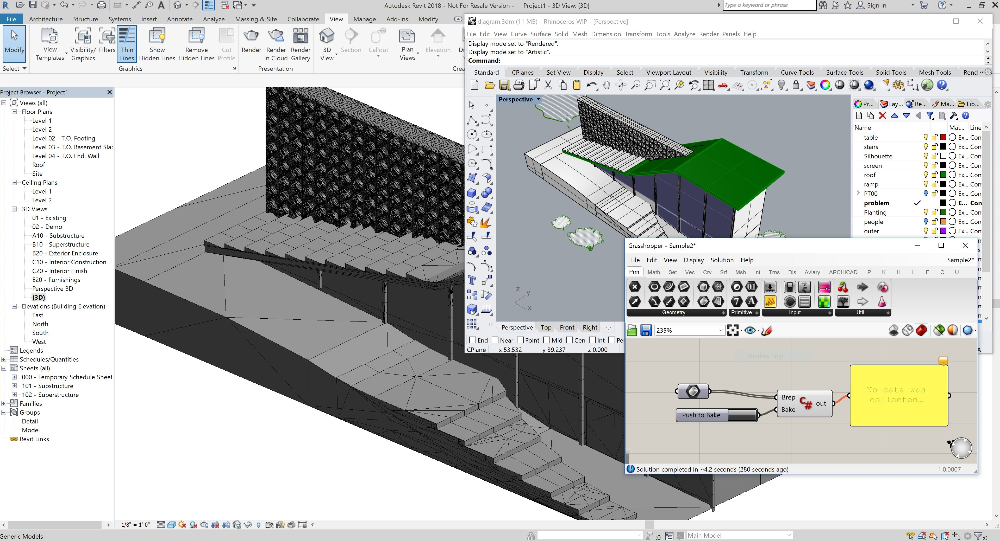
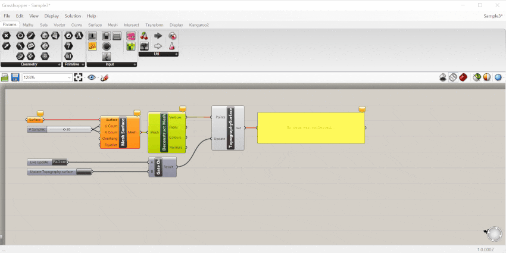
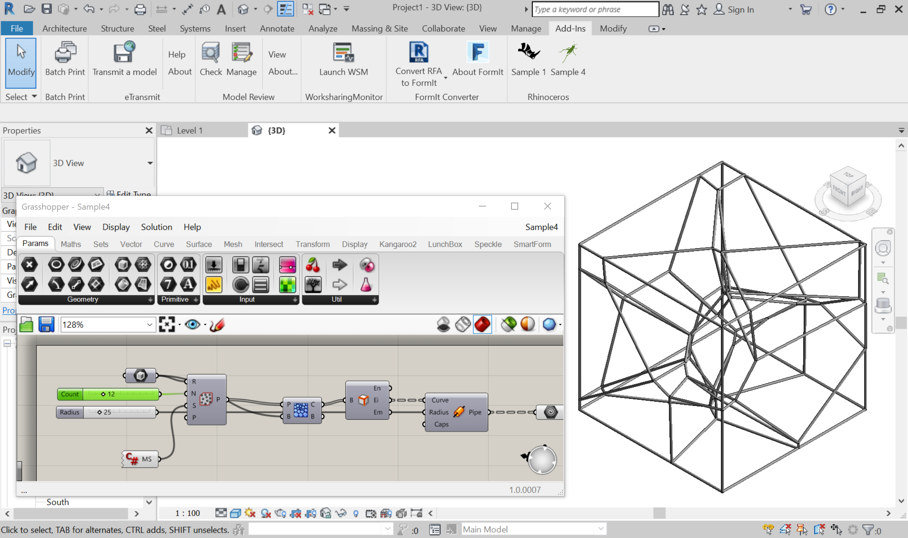
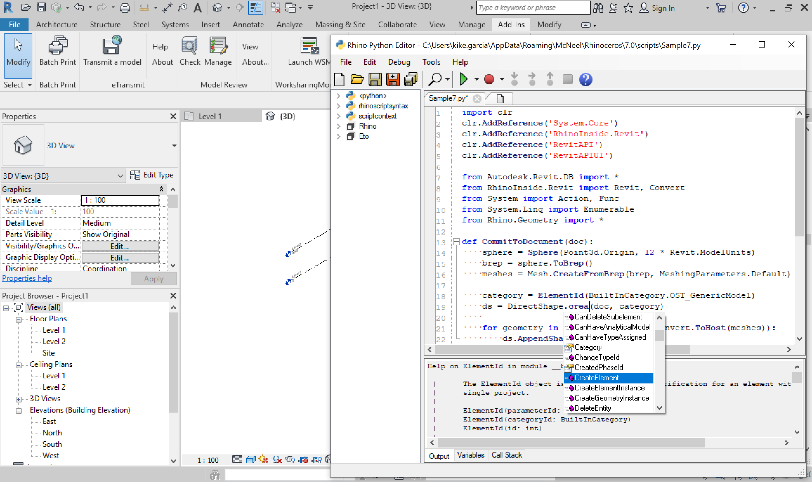

# Rhino.Inside® for Revit

The Rhino.Inside® technology allows Rhino and Grasshopper to be embedded within other products.

This folder contains a sample project that demonstrates:

1. Starting Rhino, Grasshopper and the Rhino.Python Editor as a Revit Addon.
2. Call directly into the native Revit APIs from a Grasshopper or Rhino plugin.
2. Grasshopper definitions can be opened within the Revit.
3. Includes a Revit Toolbar in Grasshopper with Revit specific components
3. Object can be natively created by Rhino or Grasshopper within Revit.

[**Questions?** *Visit the discussion forum...*](https://discourse.mcneel.com/c/rhino-inside/Revit)

## Getting started
Grab the **[latest installer](https://www.rhino3d.com/download/rhino.inside-revit/7/wip)** (requires [Rhino WIP](https://www.rhino3d.com/download/rhino/wip) and Revit 2017-2020)

If you are looking to contribute to or customize this project go to the [build from source instructions](build-source.md).

### Installing & Uninstalling
The installer copies the necessary files to the _"%APPDATA%\\Autodesk\\Revit\\Addins\\<revit_version>\\"_ folder (for each supported version). Restart Revit to load the add-on.

To uninstall, open _Programs and Features_, select "RhinoInside.Revit" and click "Uninstall".

## Using the samples
* Once you launch Revit it will warn you this addon is not verified, please click on "Load always" or "Load once".
* Create a new project or open an existing one.
* Now in the Add-ins Ribbon tab you have a _Rhinoceros_ section.
* Be careful about your model units in Rhino
* The source for all the developer samples can be found here:  https://github.com/mcneel/rhino.inside/tree/master/Autodesk/Revit/src/RhinoInside.Revit/Samples

### Sample 1
1. Open the ribbon tab called _Add-Ins_.
2. Click on the button you will found on the _Rhinoceros_ panel called _Sample 1_.
3. You should have an sphere in the Revil model.

### Sample 2

1. Use the _Rhino_ icon into the Add-Ins tab to open Rhino editor window.
2. Create some breps in Rhino. (It is best if they are building size objects to start.)
3. Run _Grasshopper_ command.
4. Open _"Sample2.ghx"_ file in Grasshopper.
5. Inside Grasshopper using the _Brep_ param pick the breps you created in step 2.
6. The Value List component (looks like a dropdown selector) will allow you to specify which Revit OST Category you want geometry to be "baked" into.
7. Inside Grasshopper click on the button _Push to Bake_.
8. You should have the breps created in step 2 in the Revit model, and they should belong to the specified category (Generic is available and is also used as a catch-all fallback).

### Sample 3

1. Use the _Rhino_ icon into the Add-Ins tab to open Rhino editor window.
2. Create a surface on Rhino. (It is best if it is site size objects to start.)
4. Run _Grasshopper_ command.
5. Open _"Sample3.ghx"_ file in Grasshopper.
6. Inside Grasshopper using the _Surface_ param pick the breps you created in step 2.
7. Inside Grasshopper click on the button _Update Topography surface_.
8. You should have a Topography surface in Revit.

### Sample 4

1. Open the ribbon tab called Add-Ins.
2. Click on the button on the _Rhinoceros_ panel called _Sample 4_.
3. Open _"Sample4.ghx"_ file.
4. The Grasshopper definition will be evaluated in background and the result baked in the Revit model.
5. You should have a collection of pipes over a 3D Voronoi diagram in Revit.

### Sample 5

1. Open the ribbon tab called Add-Ins.
2. Click on the button on the _Rhinoceros_ panel called _Grasshopper_.
3. Open the _Revit_ tab in the Grasshopper toolbar.
3. Enjoy!!

### Sample 6

1. Use the _Rhino_ icon into the Add-Ins tab to open Rhino editor window.
2. Create some geometry in Rhino.
3. Click on the button on the _Rhinoceros_ panel called _Sample 6_.
4. You should have a preview of Rhino geometry in the Revit view.

### Sample 7

1. Use the _Python_ icon into the Add-Ins tab to open Rhino Python editor window.
2. Load pyhthon script file called _"Sample7.py"_ there is in this folder.
3. Click on the green play button you will found on the Pyhton script editor window.
4. You should have an sphere in the Revil model.
