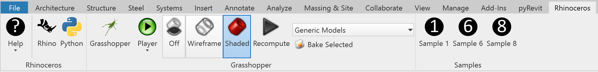
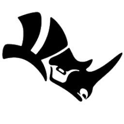

# Getting Started with Rhino in Revit

Here is how to get started with Rhino/Grasshopper in Revit.

After installing RhinoInside Revit, a toolbar will show up in Revit under Add-ons.

- The Rhino icon will start Rhino to run inside Revit.
- The Grasshopper icon will start the Grasshopper canvas to run inside Revit.  From here the GHRevit toolbar can be used.
- The Python button will start the Rhino.Python editor in Revit.
- Sample 1 will simply draw a Rhino sphere in Revit as a example for developers.
- The Grasshopper Player will run any existing Grasshopper definition and immediately return to Revit.

##  Running Rhino in Revit

While there is no direct command in Rhino to push gemotry into Revit directly there are a number of simple ways Rhino geometry can be pushed into Revit from Rhino.  

When Revit starts with the RhinoInside add-on, Rhino and Grasshopper do startup in the background. Use the Rhino button in the Revit Toolbar to bring up the Rhino running inside.

Using a simple Grasshopper component seems the best way to get Rhino geometry into Revit. Press the Grasshopper button in Rhino to start Grasshopper.

Within the Grasshopper Revit Toolbar is the Directshape Component.  Along with the Direct Shape Category component, geometry can be selected in Rhino and sent to Revit.

##  Running Grasshopper in Revit

Grasshopper can be started within Revit. Within Grasshopper there is a Revit toolbar of components which manage the interaction of Grasshopper and Revit.  To find out more about these tools, see the [Grasshopper Components in Revit Guide](gh-components.md)

<!---
When interacting with Grasshopper Params, it is important to note that Rhino also needs to be visible.
-->

##  Running Rhino.Python in Revit

The Rhino.Python editor can be called up from within Revit. By referencing the Revit.Python namespaces, both the Rhino and Revit Python scripts can be called from a single Python script.

## Running the Grasshopper Player in Revit
The Grasshopper Player will play a single grasshopper definition and return the results to Revit.
