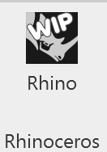
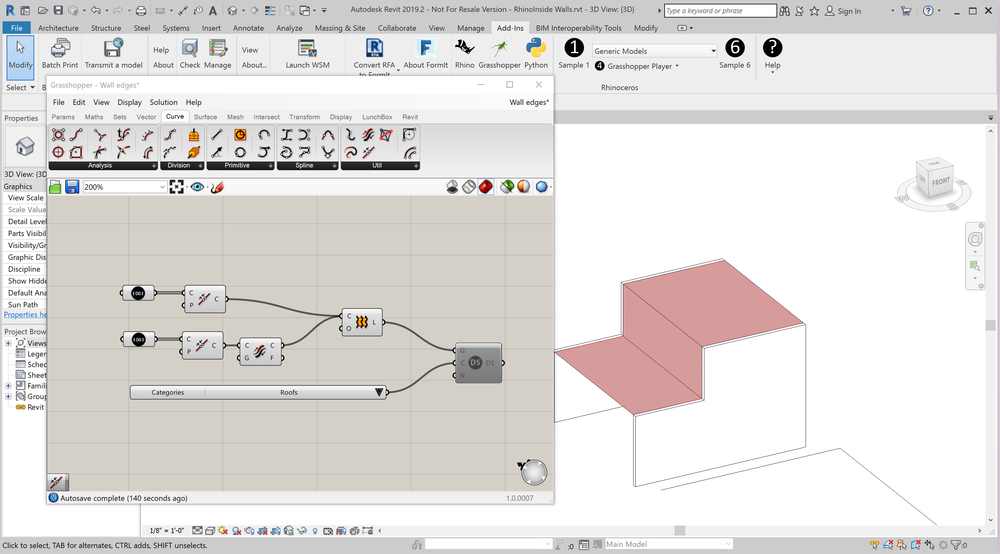

# Getting Started with Rhino in Revit

Here is how to get started with Rhino/Grasshopper in Revit.

After installing Rhino.Inside Revit, a toolbar will show up in Revit under Add-ons.  Press the Rhinoceros button to load Rhino.inside.

</img>    

Once Rhino.inside is successfully loaded, a Rhinoceros toolbar will appear in Revit:

<table style="width:100%">
  <tr>
    <th width="48px">Icon</th>
    <th>Description</th>
  </tr>
  <tr>
    <td width="48px"></td>
    <td>Contains links to all the help resources for Rhino.inside Revit.</td>
  </tr>
  <tr>
    <td></td>
    <td>The Rhino icon will start Rhino to run inside Revit. Grasshopper can also be run from within that Rhino instance.</td>
  </tr>
  <tr>    
      <td></td>    
      <td>Run the Rhino.Python editor that can be used to write Python scripts that combine both the Rhino and Revit API in the same script. See <a href="Autodesk/Revit/src/RhinoInside.Revit/Samples/Sample7.py">Sample 7</a> for a detailed look at the Python code.</td>  
  </tr>
  <tr>          
      <td></td>
      <td>Open the Grasshopper Canvas in Revit.</td>    
  </tr>
    <tr>          
      <td></td>
      <td>The Grasshopper Player will run any existing Grasshopper definition and immediately return to Revit.</td>
    </tr>
  <tr>          
      <td></td>
      <td>Turns off the real-time preview by Grasshopepr in Revit.</td>    
  </tr>
    <tr>          
      <td></td>
      <td>Grasshopper will use a wireframe display for real-time preview of geometry in Revit.</td>    
    </tr>
    <tr>          
      <td></td>
      <td>Grasshopper will use a shaded display mode for real-time preview of geometry in Revit.</td>
    </tr>
    <tr>          
      <td></td>
      <td>Forces a recompute to the loaded Grasshopper definitions.</td>
  </tr>
    <tr>          
      <td></td>
      <td>Bakes the currently selected Rhino Geometry into the currently selected Category in Revit.</td>
  </tr>
    <tr>          
      <td></td>
      <td>Sample 1 will simply draw a Rhino sphere in Revit as a example for developers.</td>
    </tr>
    <tr>          
      <td></td>
      <td>Sample 6 will toggle the visibility of Rhino geometry in Revit.</td>
    </tr>
    <tr>          
      <td></td>
      <td>Sample 8 will allow Revit to open Rhino .3DM files directly.</td>
    </tr>
</table>

##  Running Rhino in Revit

While there is no direct command in Rhino to push geometry into Revit directly there are a number of simple ways Rhino geometry can be pushed into Revit from Rhino.  

When Revit starts with the Rhino.Inside add-on, Rhino and Grasshopper do startup in the background. Use the Rhino button in the Revit Toolbar to bring up the Rhino running inside.

Using a simple Grasshopper component seems the best way to get Rhino geometry into Revit. Press the Grasshopper button in Rhino to start Grasshopper.

Within the Grasshopper Revit Toolbar is the Directshape Component.  Along with the Direct Shape Category component, geometry can be selected in Rhino and sent to Revit.

##  Running Grasshopper in Revit

Grasshopper can be started within Revit. Within Grasshopper there is a Revit toolbar of components which manage the interaction of Grasshopper and Revit.  

To find out more about these tools, see the [Grasshopper Components in Revit Guide](gh-components.md)

##  Running Rhino.Python in Revit

Both the Revit and Rhino APIs are available simultaneously with Rhino.inside.  There are two main ways Python is used.

1. [Create custom Python components in Grasshopper that are Revit aware](ghpython-in-revit.md)
2. Use the Rhino Python editor to create Python Scripts.

The Rhino.Python editor can be called up from within Revit. By referencing the Revit.Python namespaces, both the Rhino and Revit Python scripts can be called from a single Python script.

## Running the Grasshopper Player in Revit
The Grasshopper Player will play a single grasshopper definition and return the results to Revit.
