# Grasshopper components for Revit
The Rhino Inside® technology allows Rhino and Grasshopper to be embedded within Revit.

It is important to have a basic understanding to the [Revit Data Hierarchy](https://www.modelical.com/en/gdocs/revit-data-hierarchy/) of Category -> Family -> Type -> Instance/Element to create and select elements. There is a good guide at [Revit Families: A Step-By-Step Introduction](https://www.autodesk.com/autodesk-university/article/Revit-Families-Step-Step-Introduction-2018)

This guide documents the Grasshopper components that support Revit interaction.

## Components

#### Parameter Components (Params tab)

<table style="width:100%">
  <tr>
    <th width="48px">Icon</th>
    <th width="200">Name</th>
    <th>Description</th>
  </tr>
  <tr>
    <td></td>
    <td>Category</td>
    <td>Revit Category Param used for selecting persistent Category (future)</td>
  </tr>
  <tr>
    <td></td>
    <td>Element</td>
    <td>Select one or more persistent Element(s) in Revit to be used in Grasshopper. Also can be used to convert a sub-part to the parent element</td>
  </tr>
  <tr>
    <td>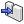</td>
    <td>Element Type</td>
    <td>Get Element type from the Element(s) input</td>
  </tr>
  <tr>
    <td>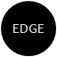</td>
    <td>Edge Element</td>
    <td>Select a Revit Element Edge(s)</td>
  </tr>
  <tr>
    <td>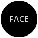</td>
    <td>Face Element</td>
    <td>Select a Revit Element Face(s)</td>
  </tr>
  <tr>
    <td></td>
    <td>Vertex Element</td>
    <td>Select a Revit Element Vertex(s)</td>
  </tr>
  <tr>
    <td></td>
    <td>Revit SketchPlane</td>
    <td>Represents a Revit document sketch plane. (Selector in the future)</td>
  </tr>
</table>

#### Build Components

<table style="width:100%">
  <tr>
    <th width="48px">Icon</th>
    <th width="200">Name</th>
    <th>Description</th>
  </tr>
  <tr>    
      <td width="48px"></td>    
      <td>Add Adaptive Component by Points</td>    
      <td>Adds an adaptive component instance using a list of points to Revit.  The points must be sorted in the same order as the adaptive component expects.</td>  
    </tr>
    <tr>
    <td width="48px"></td>
    <td>Add Beam By Curve</td>
    <td>Create a Revit Beam Object using a 2d or 3d curve for an axis/  Also assign a level.</td>
  </tr>
  <tr>
    <td></td>
    <td>Add Column By Curve</td>
    <td>Create a Revit Column Object using an axial curve</td>
  </tr>
  <tr>
    <td></td>
    <td>Add Family Instance by Location</td>
    <td>Given a position, add a FamilyInstance element to the active Revit document in a host element.</td>
  </tr>
  <tr>
    <td></td>
    <td>Add Floor By Outline</td>
    <td>Create a Revit Floor using a plan curve</td>
  </tr>
  <tr>
    <td></td>
    <td>Add Roof By Outline</td>
    <td>Create a Revit Roof by using a boundary curve, type and level.</td>
  </tr>
  <tr>
    <td></td>
    <td>Wall By Curve</td>
    <td>Create a Revit Wall Object using a plan curve. The Level, Type, Height and other properties can be specified. See the component help for options.</td>
  </tr>
  <tr>
    <td></td>
    <td>Add DirectShape By Location</td>
    <td>Create a Directshape instance from a Directshape Type. Insert a specific DirectShape instance. The input for this component many times will the the Element Type By Name Component.</td>
  </tr>
</table>

#### Category Components

<table style="width:100%">
  <tr>
    <th width="48px">Icon</th>
    <th width="200">Name</th>
    <th>Description</th>
  </tr>
  <tr>
    <td width="48px">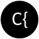</td>
    <td>Category Decompose</td>
    <td>Break a Revit Category into its component parts.  Name, Parent, Line-Color, Material, Allow Bounds and Material Quantities</td>
  </tr>
  <tr>
    <td></td>
    <td>Category Types</td>
    <td>A pick list of category types in Revit.</td>
  </tr>
  <tr>
    <td></td>
    <td>DirectShape Category Selector</td>
    <td>Select a category for using with the DirectShape Component</td>
  </tr>
</table>

#### Datum Components

<table style="width:100%">
  <tr>
    <th width="48px">Icon</th>
    <th width="200">Name</th>
    <th>Description</th>
  </tr>
  <tr>
    <td width="48px"></td>
    <td>Add Grid by Line</td>
    <td>Add a Revit Grid line through a Rhino curve.</td>
  </tr>
  <tr>
    <td>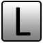</td>
    <td>Add Level by Elevation</td>
    <td>Add level by supplying an elevation height.</td>
  </tr>
</table>

#### Document Components

<table style="width:100%">
  <tr>
    <th width="48px">Icon</th>
    <th width="200">Name</th>
    <th>Description</th>
  </tr>
  <tr>
    <td width="48px">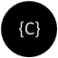</td>
    <td>Document Categories</td>
    <td>Get Active Document Category list Using the Type, and HasMaterial filter.</td>
  </tr>
  <tr>
    <td>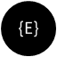</td>
    <td>Document Elements</td>
    <td>Get Active Document Elements list using a Category filter</td>
  </tr>
  <tr>
    <td>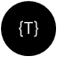</td>
    <td>Document Element Types</td>
    <td>Get Active Document Element Types using the Category, Family and Type filter</td>
  </tr>
  <tr>
    <td></td>
    <td>Document Levels</td>
    <td>Get Active Document levels list from Revit</td>
  </tr>
  <tr>
    <td>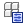</td>
    <td>Document Parameters</td>
    <td>Get Active Document Parameters attached to a specific category from Revit</td>
  </tr>
</table>

#### Elements Components

<table style="width:100%">
  <tr>
    <th width="48px">Icon</th>
    <th width="200">Name</th>
    <th>Description</th>
  </tr>
  <tr>
    <td width="48px">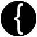</td>
    <td>Element Decompose</td>
    <td>Decompose an Element into it's associated data including Constraints, Dimensions, Identity Data, Category, Family, Type, ID, etc... Once the Elemnt is wired into this component, <code>Shift</code> double-click on the component to exapand to all Parameters of that component.  <code>Ctrl</code> double-click on the component then to collapse down to only used outputs.</td>
  </tr>
  <tr>
    <td>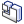</td>
    <td>Element Geometry</td>
    <td>Returns one or more Rhino Breps(s) form a Revit Element</td>
  </tr>
  <tr>
    <td></td>
    <td>Element Identity</td>
    <td>Returns Element's Name, Category, Type and UUID</td>
  </tr>
  <tr>
    <td></td>
    <td>Element Parameter Get</td>
    <td>Get Element's Parameter Value based on a Parameter Name</td>
  </tr>
  <tr>
    <td>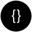</td>
    <td>Element Parameters</td>
    <td>Get Element's Parameter names attached to a specific Element</td>
  </tr>
  <tr>
    <td></td>
    <td>Element Parameters Set</td>
    <td>Set an Element's Parameter Value by Element, Key and Value</td>
  </tr>
  <tr>
    <td></td>
    <td>Element Preview</td>
    <td>Create a mesh from an Element using the LOD and the Mesh quality settings</td>
  </tr>
  <tr>
    <td>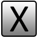</td>
    <td>Element Delete</td>
    <td>Deletes the specified element out of Revit.</td>
  </tr>
</table>

#### Geometry Components

<table style="width:100%">
  <tr>
    <th width="48px">Icon</th>
    <th width="200">Name</th>
    <th>Description</th>
  </tr>
  <tr>
    <td width="48px">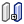</td>
    <td>Add Brep by Shape</td>
    <td>Given a Brep, it adds a Brep element to the active Revit document</td>
  </tr>
  <tr>
    <td>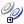</td>
    <td>Add Curve Shape</td>
    <td>Given a Curve, it adds a Curve shape to the active Revit document</td>
  </tr>
  <tr>
    <td>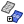</td>
    <td>Add Mesh Shape</td>
    <td>Given a Mesh, it adds a Mesh element to the active Revit document</td>
  </tr>
  <tr>
    <td>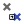</td>
    <td>Add Point Shape</td>
    <td>Given a Point, it adds a Point element to the active Revit document</td>
  </tr>
  <tr>
      <td></td>    <td>Add DirectShape Geometry</td>    <td>Create a Directshape Element from a Rhino Geometry. This is the most flexible way to import Geometry.</td>  
    </tr>
</table>

#### Revit Input Components

<table style="width:100%">
  <tr>
    <th width="48px">Icon</th>
    <th width="200">Name</th>
    <th>Description</th>
  </tr>
  <tr>
    <td width="48px">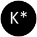</td>
    <td>Select a built-in Parameter by Name</td>
    <td>Use a checklist, dropdown, scroll sequence or cycle interface to select a Parameter Key from Revit</td>
  </tr>
  <tr>
    <td>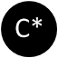</td>
    <td>Select a Document Category</td>
    <td>Use a checklist, dropdown, scroll sequence or cycle interface to select a document category from Revit</td>
  </tr>
  <tr>
    <td>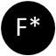</td>
    <td>Select a Family</td>
    <td>Use a checklist, dropdown, scroll sequence or cycle interface to select a family from Revit</td>
  </tr>
  <tr>
    <td>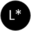</td>
    <td>Select a Level</td>
    <td>Use a checklist, dropdown, scroll sequence or cycle interface to select a level from Revit</td>
  </tr>
  <tr>
    <td>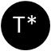</td>
    <td>Select an Element Type by Name</td>
    <td>Select a specific Element type by its name. This component will be blank unless connected in combination with the Select Document Category or the Select a Family component to select a specific element within a Family or Category. Use a checklist, dropdown, scroll sequence or cycle interface to select a Element Type from Revit 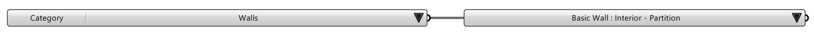</td>
  </tr>
</table>

#### Massing Components

<table style="width:100%">
  <tr>
    <th width="48px">Icon</th>
    <th width="200">Name</th>
    <th>Description</th>
  </tr>
  <tr>
    <td width="48px"></td>
    <td>Add form by Curve</td>
    <td>Given a list of curves, it adds a Form element to the active Revit document</td>
  </tr>
  <tr>
    <td>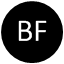</td>
    <td>Add form by Geometry</td>
    <td>Given its Geometry, it adds a Form element to the active Revit document</td>
  </tr>
</table>

#### Modeling Components

<table style="width:100%">
  <tr>
    <th width="48px">Icon</th>
    <th width="200">Name</th>
    <th>Description</th>
  </tr>
  <tr>
    <td width="48px"></td>
    <td>Add Model Line by Curve</td>
    <td>Given a Curve, it adds a Curve element to the active Revit document</td>
  </tr>
  <tr>
    <td></td>
    <td>Add Sketchplane by Plane</td>
    <td>Given a Rhino Plane, it adds a SketchPlane element to the active Revit document</td>
  </tr>
</table>

#### Parameter Components

<table style="width:100%">
  <tr>
    <th width="48px">Icon</th>
    <th width="200">Name</th>
    <th>Description</th>
  </tr>
  <tr>
    <td width="48px">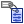</td>
    <td>Add Document Parameter by Name</td>
    <td>Given its Name, it adds a Parameter definition to the active Revit document</td>
  </tr>
  <tr>
    <td>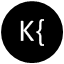</td>
    <td>Decompose a Parameter Key</td>
    <td>Decompose a parameter key into Name, Value Type, Visible Property and ID</td>
  </tr>
  <tr>
    <td>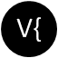</td>
    <td>Decompose a Parameter Value</td>
    <td>Decompose a parameter value into Name, Value Type, Visible Property and ID</td>
  </tr>
  <tr>
    <td width="48px">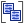</td>
    <td>Parameter Group</td>
    <td>Represent Revit Paramter Group</td>
  </tr>
  <tr>
    <td></td>
    <td>Selector for a Parameter group</td>
    <td>Use a checklist, dropdown, scroll sequence or cycle interface to select a Parameter Group from Revit</td>
  </tr>
  <tr>
    <td></td>
    <td>Parameter Key</td>
    <td>Represents a Revit Parameter Key. (Selector in the future)</td>
  </tr>
</table>

#### Site Components

<table style="width:100%">
  <tr>
    <th width="48px">Icon</th>
    <th width="200">Name</th>
    <th>Description</th>
  </tr>
  <tr>
    <td width="48px">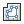</td>
    <td>Add Building Pad by Outline</td>
    <td>Given a set of contour Curves, it adds a BuildingPad element to the active Revit document</td>
  </tr>
  <tr>
    <td></td>
    <td>Add Topography Element by Points</td>
    <td>Given a set of Points, it adds a Topography surface to the active Revit document</td>
  </tr>
</table>

#### Type Components

<table style="width:100%">
  <tr>
    <th width="48px">Icon</th>
    <th width="200">Name</th>
    <th>Description</th>
  </tr>
  <tr>
    <td width="48px"></td>
    <td>Duplicate an Element Type.</td>
    <td>Given a Name, it duplicates an ElementType into the active Revit document</td>
  </tr>
  <tr>
    <td></td>
    <td>Get the Element Type Identification</td>
    <td>Query type identity information to return Category, Family Name, Name and UUID.</td>
  </tr>
  <tr>
    <td></td>
    <td>Select Similiar Types</td>
      <td> Selects the types that are Similiar to the input Type.</td>
    </tr>
  <tr>
    <td></td>
    <td>Create a DirectShape Type</td>
    <td>Given its Geometry, it reconstructs a DirectShapeType to the active Revit document
</td>
  </tr>
</table>

