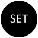

# Grasshopper components for Revit
The Rhino Inside® technology allows Rhino and Grasshopper to be embedded within Revit.

It is important to have a basic understanding to the [Revit Data Hierarchy](https://www.modelical.com/en/gdocs/revit-data-hierarchy/) of Category -> Family -> Type -> Instance/Element to create and select elements.

This guide documents the Grasshopper components that support Revit interaction.

## Components

#### Build Components

| Icon | Name | Description |
| --- | --- | --- |
|  | Beam By Curve | Create a Revit Beam Object using a 2d or 3d curve for an axis |
|  | Floor By Outline | Create a Revit Floor Object using a 2d curve |
|  | Column By Curve | Create a Revit Column Object using an axial curve|
|  | Wall By Curve | Create a Revit Wall Object using a plan curve|
|  | DirectShape | Create a Directshape Element using a plan curve. This is the most generic way to import Geometry. |
|  | DirectShape Category | Create a Directshape category For using with the DirectShape Component |

#### Category Components

| Icon | Name | Description |
| --- | --- | --- |
|  | Category Decompose | Break a Revit Category into its component parts.  Name, Parent, Line-Color, Material, Allow Bounds and Material Quantities |
|  | Category | Revit Category Param used for selecting persistent Category (future)|
|  | Category Types | A pick list of category types in Revit. |

#### Document Components

| Icon | Name | Description |
| --- | --- | --- |
|  | Document Categories | Get Active Document Category list Using the Type, and HasMaterial filter. |
|  | Document Elements | Get Active Document Elements list using a Category filter|
|  | Document Element Types | Get Active Document Element Types using the Category, Family and Type filter|
|  | Document Levels | Get Active Document levels list from Revit|
|  | Document Parameters | Get Active Document Parameters attached to a specific category from Revit |

#### Elements Components

| Icon | Name | Description |
| --- | --- | --- |
|  | Element Decompose | Decompose an Element into it's associated data including Constraints, Dimensions, Identity Data, Category, Family, Type, ID, etc...|
|  | Element Geometry | Returns one or more Rhino Breps(s) form a Revit Element|
|  | Element Identity | Returns Element's Name, Category, Type and UUID|
|  | Element Parameter Get | Get Element's Parameter Value based on a Parameter Name.|
|  | Element Parameters | Get Element's Parameter names attached to a specific Element |
|  | Element Parameters Set | Set an Element's Parameter Value by Element, Key and Value|
|  | Element Preview | Create a Preview of an object using an Element, setting the LOD and the Mesh quality |
|  | Element| Select one or more persistent Element(s) in Revit to be used in Grasshopper|
|  | Element Type | Get Active Document Parameters attached to a specific category from Revit |
