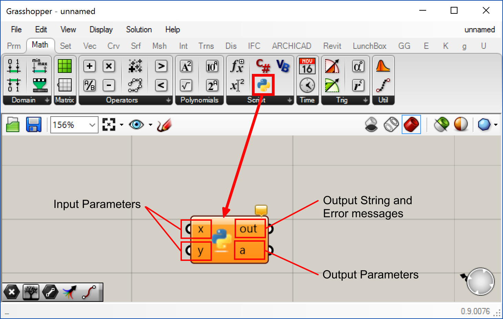
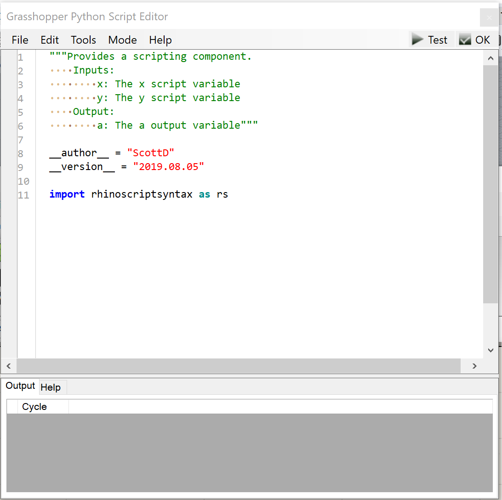
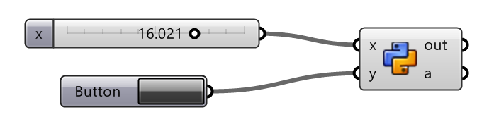

# Writing Python in Grasshopper in Revit

This guide is about writing a custom Python component in Grasshopper while running Rhino.inside Revit.

##  GH Python component

The GHpython component contains the inputs, outputs and a code editor.  To get started with the component go to the Math tab in Grasshopper and drag out the Python component. 



For a detail guide on the GHPython component in Grasshopper, please review [Your First Python Script in Grasshopper Guide](https://developer.rhino3d.com/guides/rhinopython/your-first-python-script-in-grasshopper/)

Double-click on the component to open the Python editor:



## Setting up the component

This sample component will preview a sphere of an adjustable radius in Revit and Rhino.  It will pass that sphere onto other Grasshopper components through the `a` output.  And it will Bake (actually create) the sphere in Revit and Rhino if the `button` on `y` is pressed.



Use the Python component, a slider and a button to hook up this system.

## Including the Rhino.inside and Revit APIs

There are a few libraries we need to reference in the Python component to allow access to both the Revit API and the Rhino.inside utilities:

```python
import rhinoscriptsyntax as rs # included in the existing template

import clr
clr.AddReference('System.Core')
clr.AddReference('RhinoInside.Revit')
clr.AddReference('RevitAPI') 
clr.AddReference('RevitAPIUI')

from System import Action, Func
from System.Linq import Enumerable
from Autodesk.Revit.DB import *
from Rhino import Geometry as Rhino
from RhinoInside.Revit import Revit, Convert
```

Once this foundation is layed down, then we can continue to create the script.


## Drawing a Sphere with a preview

To show how geometry created in Grasshopper will preview in both Rhino and Revit dynamically we can create this script.  Here Grasshopper will create a sphere based on the x input value:

```python
sphere = Rhino.Sphere(Rhino.Point3d.Origin, x * Revit.ModelUnits)

a = sphere #writes to output of component and previews the geometry
```
The Sphere method is from the Rhino.Geometry namespace.

By setting the output to `a` then Grasshopper will preview the results in both Rhino and Revit.  It also allows the `preview` option on the component to be toggled and the sphere geometry to be passed down to the next component.

Use the slider to adjust the radius.  Make sure the slider values are set bit enough.


## Baking objects into Revit from Python

We can add a custom baking definition in this component.  This can serve as a template to almost an  unlimited number of ways and elements that one might want to create Revit objects from Grasshopper.

Because baking objects to Revit can take a long time and many times only should be done once, this bake functions will only execute if the `y` intput is set to `TRUE` on the component. So use an input button, so if it is pressed Grasshopper will only bake the object once.

First, create a routine that can be called to bake.

```python
def CommitToDocument(doc):

    brep = sphere.ToBrep()
    meshes = Rhino.Mesh.CreateFromBrep(brep, Rhino.MeshingParameters.Default)

    category = ElementId(BuiltInCategory.OST_GenericModel)
    ds = DirectShape.CreateElement(doc, category)

    for geometry in Enumerable.ToList(Convert.ToHost(meshes)):
        ds.AppendShape(geometry)
```

Then call that `def` inside an `if` statement:

```python
if y == True:
    Revit.EnqueueAction(Action[Document](CommitToDocument))
```

## Additional Resources

Here are a few links to more resources about all the SDKs involved:

* [API Docs for Revit, RhinoCommon, Grasshopper and Navisworks](https://apidocs.co/apps/)
* [The Building Coder for expert guidance in BIM and Revit API](https://thebuildingcoder.typepad.com/)
* [The Grasshopper IO project with the largest catalog of Grasshopper components available.](https://rhino.github.io/)
* [Python guides and APi in Rhino](https://developer.rhino3d.com/guides/rhinopython/)
* [PyRevit for advanced Python in Revit](https://ein.sh/pyRevit/)
* [Data Hierarchy configuration in Revit](https://www.modelical.com/en/gdocs/revit-data-hierarchy/)

##  Completed Sample Code


```python
"""Provides a scripting component.
    Inputs:
        x: The radius of the sphere
        y: Bake the object if true
    Output:
        a: The a output variable"""

__author__ = "ScottD"
__version__ = "2019.08.05"

import rhinoscriptsyntax as rs
import clr
clr.AddReference('System.Core')
clr.AddReference('RhinoInside.Revit')
clr.AddReference('RevitAPI') 
clr.AddReference('RevitAPIUI')

from System import Action, Func
from System.Linq import Enumerable
from Autodesk.Revit.DB import *
from Rhino import Geometry as Rhino
from RhinoInside.Revit import Revit, Convert

sphere = Rhino.Sphere(Rhino.Point3d.Origin, x * Revit.ModelUnits)

a = sphere

def CommitToDocument(doc):

    brep = sphere.ToBrep()
    meshes = Rhino.Mesh.CreateFromBrep(brep, Rhino.MeshingParameters.Default)

    category = ElementId(BuiltInCategory.OST_GenericModel)
    ds = DirectShape.CreateElement(doc, category)

    for geometry in Enumerable.ToList(Convert.ToHost(meshes)):
        ds.AppendShape(geometry)


if y == True:
    Revit.EnqueueAction(Action[Document](CommitToDocument))

```

