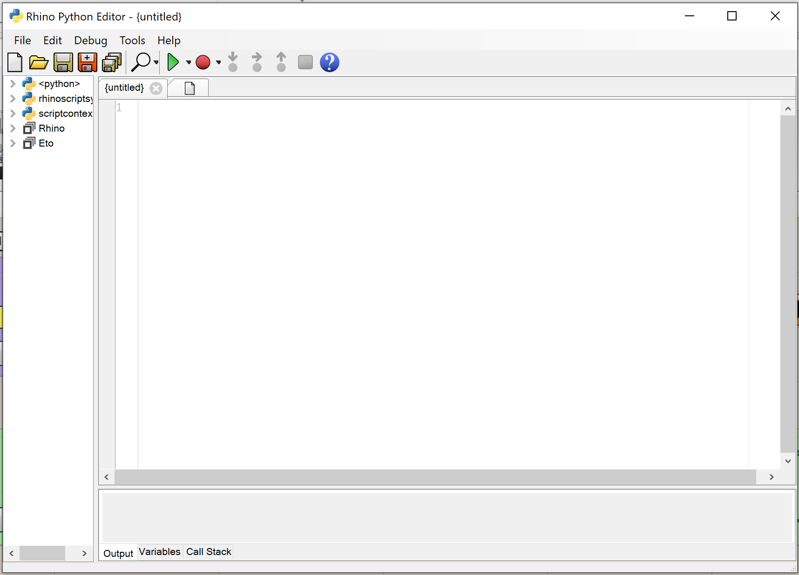

 


# Writing Python in Rhino within Revit

This guide is about writing a custom Python component in Grasshopper while running Rhino.inside Revit. This sample component will create a sphere with Rhino and then draw it in Revit. 

## Rhino.Python editor

The Rhino.Python editor can be called up from within Revit. By referencing the Revit.Python namespaces, both the Rhino and Revit Python scripts can be called from a single Python script.

Once Rhino.inside is successfully loaded, a Rhinoceros toolbar will appear in Revit:


Select the Python Icon   to bring up the Python Editor:


  

For a detail guide on the Python in Rhino see the guides on [Rhino.Python Developer Guides](https://developer.rhino3d.com/guides/rhinopython/)

By default, the Python opens like this:




## Including the Rhino.inside and Revit APIs

There are a few libraries we need to reference in the Python component to allow access to both the Revit API and the Rhino.inside utilities.  These lines will need to exist at the start of every Rhino.inside Revit script.

```python
import clr
clr.AddReference('System.Core')
clr.AddReference('RhinoInside.Revit')
clr.AddReference('RevitAPI') 
clr.AddReference('RevitAPIUI')

from System import Action, Func
from System.Linq import Enumerable
from Autodesk.Revit.DB import *
from Rhino import Geometry as Rhino
from RhinoInside.Revit import Revit, Convert
```
Once this foundation is layed down, then we can continue to create the script.


## Creating Objects  into Revit from Python

We can add a custom baking definition in this component.  This can serve as a template to almost an  unlimited number of ways and elements that one might want to create Revit objects from Grasshopper.

Create a definition that can create geometry in Revit called CommitToDocument.  In this case we create a mesh, but other Gemetry types can be created in similiar ways.

```
def CommitToDocument(doc):
    meshes = Rhino.Mesh.CreateFromBrep(brep, Rhino.MeshingParameters.Default)

    category = ElementId(BuiltInCategory.OST_GenericModel)
    ds = DirectShape.CreateElement(doc, category)

    for geometry in Enumerable.ToList(Convert.ToHost(meshes)):
        ds.AppendShape(geometry)
```
## Creating a Sphere in memory

THen we get to creating the sphere using Rhino geometry methods. Create a sphere with a radius of 12 units:

```python
sphere = Rhino.Sphere(Rhino.Point3d.Origin, 12 * Revit.ModelUnits)
```
The Sphere method is from the Rhino.Geometry namespace.

Converting that Sphere to a generic NURBS Brep is easy:

```python
brep = sphere.ToBrep()
```
And finally, use the CommitToDocument definition to push the sphere into Revit:

```python
Revit.EnqueueAction(Action[Document](CommitToDocument))
```

## Additional Resources

Python scripts created for Revit can be organized and distributed using * [PyRevit for advanced Python in Revit](https://ein.sh/pyRevit/)

Here are a few links additional resources about all the SDKs involved:

* [API Docs for Revit, RhinoCommon, Grasshopper and Navisworks](https://apidocs.co/apps/)
* [The Building Coder for expert guidance in BIM and Revit API](https://thebuildingcoder.typepad.com/)
* [The Grasshopper IO project with the largest catalog of Grasshopper components available.](https://rhino.github.io/)
* [Python guides and APi in Rhino](https://developer.rhino3d.com/guides/rhinopython/)
* [Data Hierarchy configuration in Revit](https://www.modelical.com/en/gdocs/revit-data-hierarchy/)

##  Completed Sample Code

```python
import clr
clr.AddReference('System.Core')
clr.AddReference('RhinoInside.Revit')
clr.AddReference('RevitAPI') 
clr.AddReference('RevitAPIUI')

from System import Action, Func
from System.Linq import Enumerable
from Autodesk.Revit.DB import *
from Rhino import Geometry as Rhino
from RhinoInside.Revit import Revit, Convert
import json

def CommitToDocument(doc):
    meshes = Rhino.Mesh.CreateFromBrep(brep, Rhino.MeshingParameters.Default)

    category = ElementId(BuiltInCategory.OST_GenericModel)
    ds = DirectShape.CreateElement(doc, category)

    for geometry in Enumerable.ToList(Convert.ToHost(meshes)):
        ds.AppendShape(geometry)

sphere = Rhino.Sphere(Rhino.Point3d.Origin, 12 * Revit.ModelUnits)

brep = sphere.ToBrep()

Revit.EnqueueAction(Action[Document](CommitToDocument))
```

