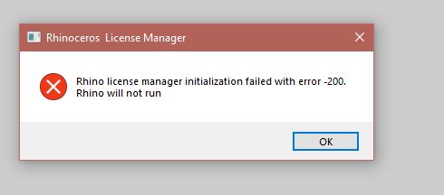
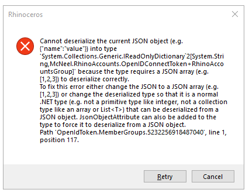
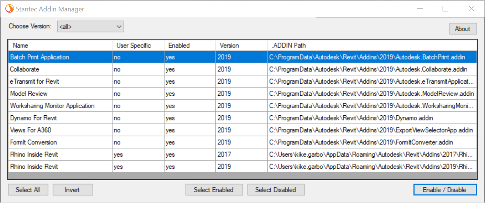

# Troubleshooting Rhino in Revit

This guide looks at errors that can appear with Rhino.inside Revit.

This address most of the common errors we have seen.  [Please contact us](https://www.rhino3d.com/support) whether any of these options worked or did not work.  We are working to minimize any of these messages.

## Rhino license manager initialization error -200.

Problem: When Rhino.inside loads and this error appears. 

Solutions:

This normally appears when there is a conflict between Rhino.inside and one or more Revit plugins that have loaded already. 

A common conflict is an older version of the PyRevit plugin.  While the newer versions to PyRevit do not cause a problem, an older version might.  Information on the PyRevit site can be found [Pyrevit issue #628](https://github.com/eirannejad/pyRevit/issues/628) . To update the older version of PyRevit use these steps:

  1.Download [Microsoft.WindowsAPICodePack.Shell](https://www.nuget.org/packages/Microsoft.WindowsAPICodePack.Shell/) and place under `bin/` directory in pyRevit installation directory. This fix will be shipped with the next pyRevit version

  1.DLL is also uploaded here for convenience if you don't know how to download nuget packages. It's placed inside a ZIP archive for security. Unpack and place under `bin/` directory in pyRevit installation directory. [Microsoft.WindowsAPICodePack.Shell.dll.zip](https://github.com/eirannejad/pyRevit/files/3503717/Microsoft.WindowsAPICodePack.Shell.dll.zip)

If this does not solve the problem, then using the Advanced Search for Conflicting plugins section.

## JSON errors on load

Problem:  A Long JSON error shows up:

Solution: Like the previous -200 error, this is a conflict with another plugin.  See the Error - 200 solution for this problem.

## Logging and debugging messages

Rhino 7 can creates a log on the desktop to see all the loading frameworks that are required. By sending us this log we can determine many conflicts.

The Rhino 7 being used must date later then 8-20-2019, or use this build if it is before that day: http://files.mcneel.com/dujour/exe/20190814/rhino_en-us_7.0.19226.11575.exe

1. Once installed, create a blank text file on your desktop named exactly  `RhinoAssemblyResolveLog.txt` 
2. Run Revit, Rhino.inside and Grasshopper.  
3. Then close the applications
4. Send [McNeel Technical Support](https://www.rhino3d.com/support) the resulting log file.
5. Rename the log file to something else, so that logging will not continue.
     

## Advanced search for conflicting plugins

Here is a tool that allows you to disable all but one plugin easily and test if it works. Once determining the conflicting plugins,  [please contact us...](https://www.rhino3d.com/support)

If Rhino.inside works when loaded alone, then use this app to enable more plugins and test again until the plugins are not compatible are found.  Hint: there may be more then one plugin that causes trouble.

To download and install the troubleshooter please follow instructions found [here 3](http://revitaddons.blogspot.com/2016/11/free-and-open-source-add-in-manager.html):

> 1. Download the tool from [Bitbucket here 5](https://bitbucket.org/BoostYourBIM/stantecaddinmanager/downloads).
> 2. Find where you downloaded the zip file and unzip it.
> 3. When unzipped, there will be a BIN folder; browse into the BIN folder then the Debug sub-folder.
> 4. Run the tool by double-clicking on the exe file.
> 5. In the window that opens, pick your version of Revit (or go with all if you like).
> 6. The data grid will update to display all of the machine wide and the logged in user specific add-ins installed. You can pick and choose, invert, select all, then simply click on the “Enable/Disable” button to either enable or disable the selected add-ins.
> 7. Once you’ve made your choices, start Revit in the normal manner. Simple and easy.

Or download it from [here 2](https://bitbucket.org/BoostYourBIM/stantecaddinmanager/raw/03365f38188029436251f88f88dfa26db22bf8aa/AddInManager/bin/Debug/AddInManager.exe).

## Advance SDK debug messages

There is a way to increase the number and detail of the error messages in Rhino.inside.  This is a good way to find a specific error that may lead to a solution.

1. Please unzip [RhinoSDK-Messages.zip](https://aws1.discourse-cdn.com/mcneel/uploads/default/original/3X/6/3/6348e99914b9e66417720df74f4cc35ba3e31c6f.zip) and open the file “**Enable RhinoSDK Messages.reg**”
2. Then run again Rhino inside Revit.
3. Some message boxes should appear.
4. Please capture those messages using some screenshot tool like Windows Snipping Tool and send it to  [McNeel Technical Support](https://www.rhino3d.com/support)
5. Remember to open the “**Disable RhinoSDK Messages.reg**” to turn those dialogs off again.