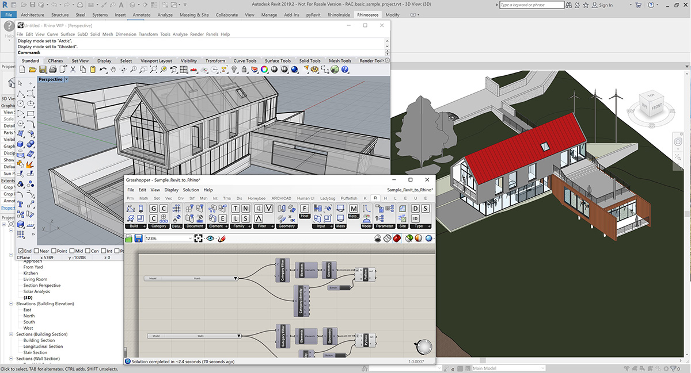
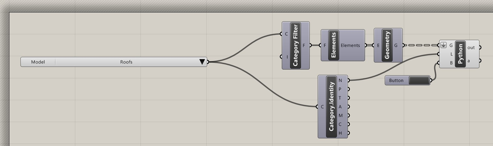
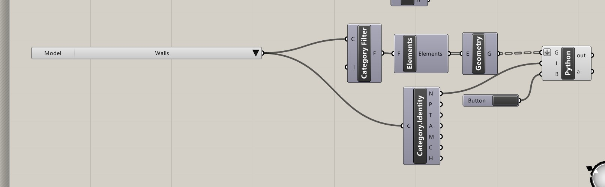

# Bringing in a Revit&reg; model to Rhino&reg;
This sample shows how to take Revit objects into Rhino

### Open Sample files:

1. Open the standard Revit sample file *RAC_basic_sample_project.rvt*.
1. Setting the view to the standard Revit 3d view helps see what is happening in this tutorial 
1. Start Rhino inside Revit by pressing the the Rhino icon under Add-Ins.
1. In the Rhinoceros Toolbar in Revit, open Rhino and a new blank Rhino model.
1. Start Grasshopper within Rhino.
1. Open the [Sample_Revit-to_rhino.gh](Sample_Revit_to_Rhino.gh)

### Bringing across the model:

The Grasshopper definition is split up in a series of categories with a button to activate each one individually.  Please note that the first one you use may not show as the Rhino model probably is not zoomed into the correct area of the model by default.

1. Zoom into the top section of the definition where `Roofs` are going to be transferred. 
2. Click on the `Button` to the right of the definition.  This will activate and import the Roof geometry on a Layer in Rhino called Roof. 
3. Click on the Zoom Extents icon in Rhino to find the Roof geometry.  This will set the view so you can see the rest of the transfers.
4. Zoom in the next section in Grasshopper definition on the`Walls` section. 
5. Click on the `Button` to the right of the definition. This will bring in the walls.
6. Go to each successive section in Grasshopper to bring in the rest of the categories.
7. Set the view type in Rhino to Shaded. 

