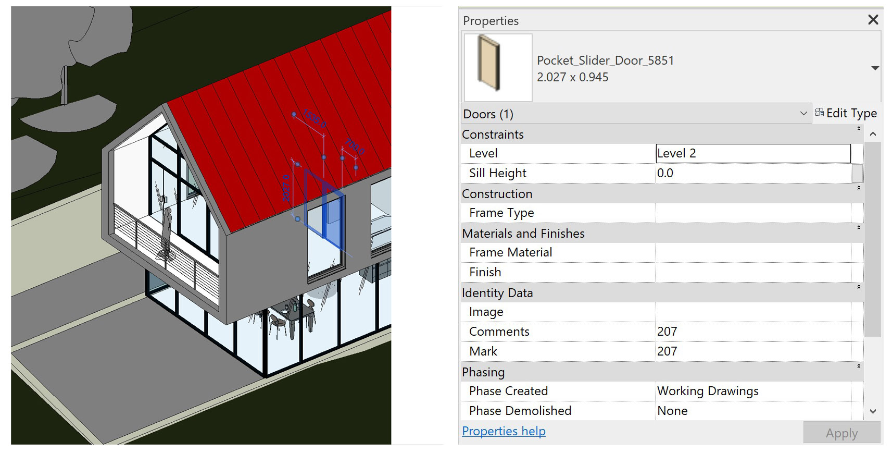
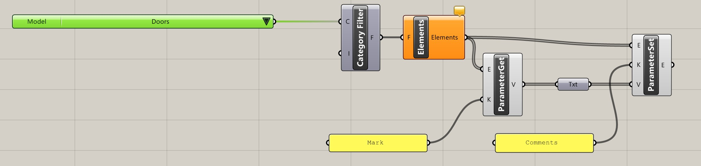
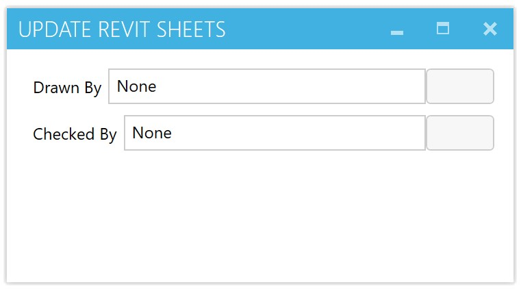

# Managing Parameters with Grasshopper&reg;
This sample shows how to read and write the parameters of Revit&reg; elements usign Grasshopper and Rhino&reg;. There are two sample files here. 

1. The first sample will simple copy the Mark value from each door and palce it in the comments parameter of the same door.
2. The second sample will change the Edited BY show how HumanUI can be used to create a 

## Reading and Writing Parameters First Sample:

1. Open the standard Revit sample file *RAC_basic_sample_project.rvt*.
1. Setting the view to the standard Revit 3d view helps see what is happening in this tutorial 
1. Start Rhino inside Revit by pressing the the Rhino icon under Add-Ins.
1. In the Rhinoceros Toolbar in Revit, select the Rhino Player icon 
	
1. Open the [Sample Door Parameter Script.gh](Sample_Door_Parameter_Script.gh)

This definition will run immediately. Grasshopper will not show, and the player will start and finish. If you select one of the doors, you will see the Mark and Comment are now duplicated.

 

Now take a look at the definition by selecting the Grasshopper Icon in the Revit Rhinoceros Toolbar and opening the [Sample Door Parameter Script.gh](Sample_Door_Parameter_Script.gh) definition.

The definition finds all the Doors setting a Category Filter and finding all the Elements of that Category. Then, using the *ParameterGet* Component each `Mark` is found for each door.  Then the `Comments` parameter is set using the *ParameterSet* component.

### Using a Human UI dialog to change parameters:

The second example here requires the [HumanUI plugin for Grasshopper](https://www.food4rhino.com/app/human-ui). This is a plugin allowing Grasshopper to design and display dialog box interfaces.  In this case the dialog interface will help edit the *Drawn by* and the *Checked by* sections of the title block.

1. Open the *A001 - Title Sheet* * in the standard *RAC_basic_sample_project.rvt*.
2. In the Rhinoceros Toolbar in Revit, select the Rhino Player icon 
3. Open the [Sample_Write_Sheet_HumanUI_Script.gh](Sample_Write_Sheet_HumanUI_Script.gh)

This definition will run the Human UI dialog immediately without showing Grasshopper.

Simply edit the Text filed and click on the update buttons to the right.  The Titleblock will change.

To see how the definition works, just open the Grasshopper canvas and open the script.

