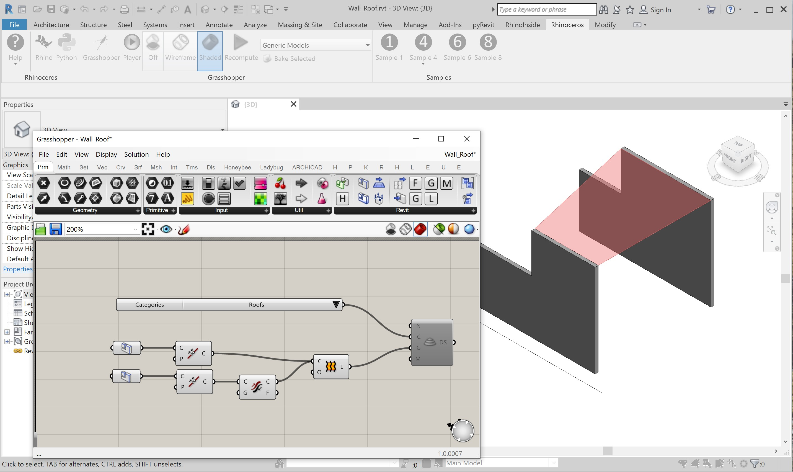
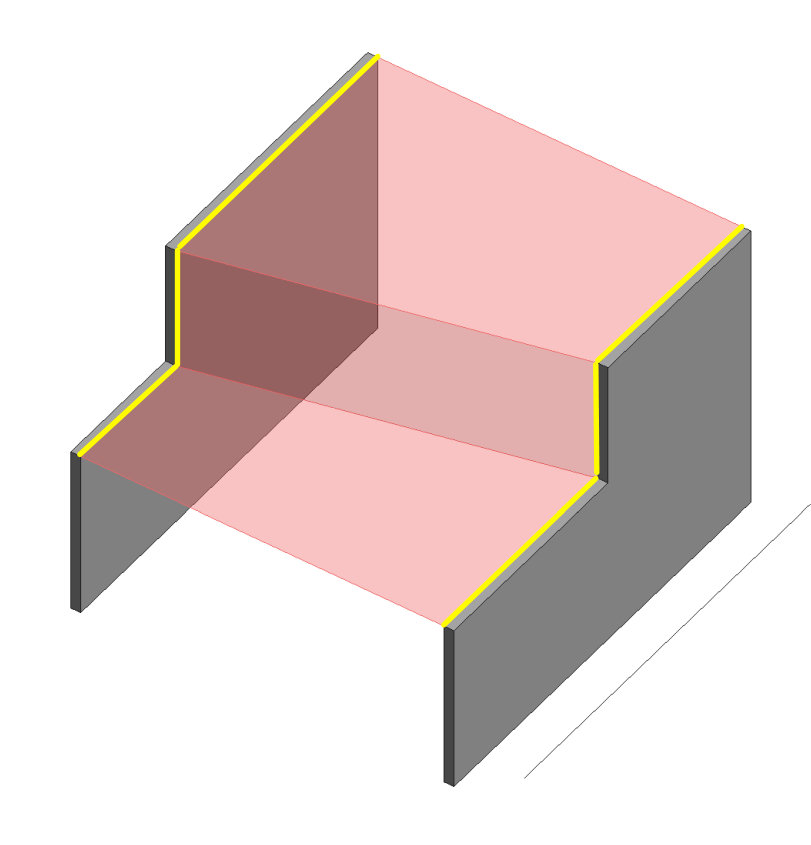

# Using Revit&reg; Elements in Grasshopper&reg;
This sample shows how to Select Revit Element edges as input to a Grasshopper lofted surface.

Using Revit objects as input to Grasshopper definitions allows for a dynamic editing directly in Revit and making Grasshopper interactive within the the Revit model.

### Selecting Revit elements as input
On the Params tool tab is a Revit group which contains Revit element pickers including Revit Elements, Edges, Vertices and Faces.  Also available are the non-model elements such as Category, Type, Family, Grid, Level and Material.

Open Sample files:
1. Open the [Wall_Roof.rvt](/wall_roof.rvt) in Revit 2019.
1. Start Rhino.Inside.Revit.
1. Start Grasshopper within Revit.

The components necessary:
1. Revit Edge params.
1. Document Category picker
1. Curve Join components if multiple curves are selected
1. Curve Flip component to make sure the curves are going in the same direction.
1. Grasshopper Loft component to create the lofted surface
1. A Revit Directshape component.  (Disabled by default)

### Live-linking Edges from Revit

To start the definition, right click on the top Edge component: 

Then select one of the Yellow edges on one side of the the Wall model. Use the Finish button under the Revit toolbar to finish the selection.

Then right click and select to opposite edge.

A preview loft surface should show up

### Edit the Revit object with dynamic preview
1. Click on a wall in Revit twice and use the edit arrows to edit the shape of the walls.  The lofted surface should update.

### Creating a Revit DirectShape Roof
By Enabling the Directshape component in the Grasshopper canvas, Grasshopper will then create a Roof based on the lofted surface from Grasshopper.

Of course with a little more work that roof could be a Roof from Boundary and create a Roof System family.