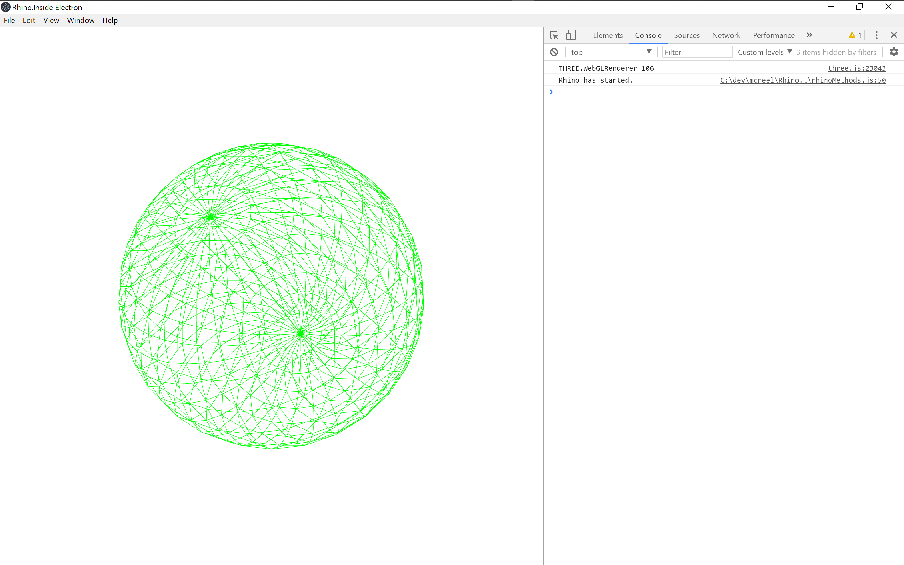

# Rhino Inside Node.js
The Rhino Inside® technology allows Rhino and Grasshopper to be embedded within other products.

## Sample 3
This sample shows how to run Rhino from `Electron`.
This sample extends Sample 1 and 2 by using Electron for UI. Geometry rendered with [three.js](https://threejs.org).
The sample has been tested on Windows 10, Rhino 7 WIP, and Node.js 8.11.12 (though should work on more recent versions of Node.js)

There are two projects in this sample:
- `InsideElectron.csproj` - Compiles to a .net Core 2.0 class library with one class and several methods. This class contains the code to start Rhino.
- `InsideElectronApp` - The Electron app that provides a GUI and launches Rhino and Grasshopper from JavaScript.

### Dependencies
- [`Rhino 7 WIP`](https://www.rhino3d.com/download/rhino-for-windows/wip) (Required install)
- [`Node.js (8.11.2 or newer)`](https://nodejs.org/) (Required install)
- [`edge.js (^11.3.1)`](https://github.com/agracio/edge-js) (Referenced via npm)
- [`Electron.js`](https://electronjs.org/) (Referenced via npm)
- [`rhino3dm.js`](https://www.rhino3d.com/rhino3dm) (Referenced via URL)
- [`three.js`](https://threejs.org/) (Referenced via URL)

### Running this sample
This assumes you've already installed Rhino 7 WIP and Node.js for Windows, and have cloned the Rhino.Inside repository.
1. Open a console from the `InsideElectronApp` directory.
2. Run `npm install` to install any dependencies.
3. Open the `InsideElectron.sln` in Visual Studio and build the solution. This builds the .dll which is referenced in the Electron app.
4. Run `npm start` to run the sample. You should see:

