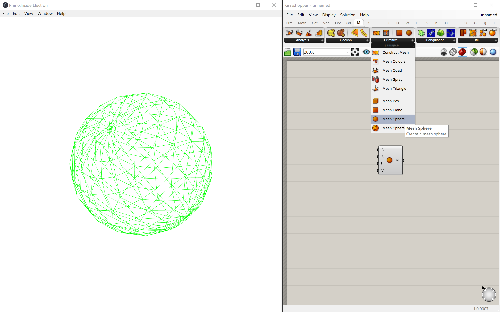
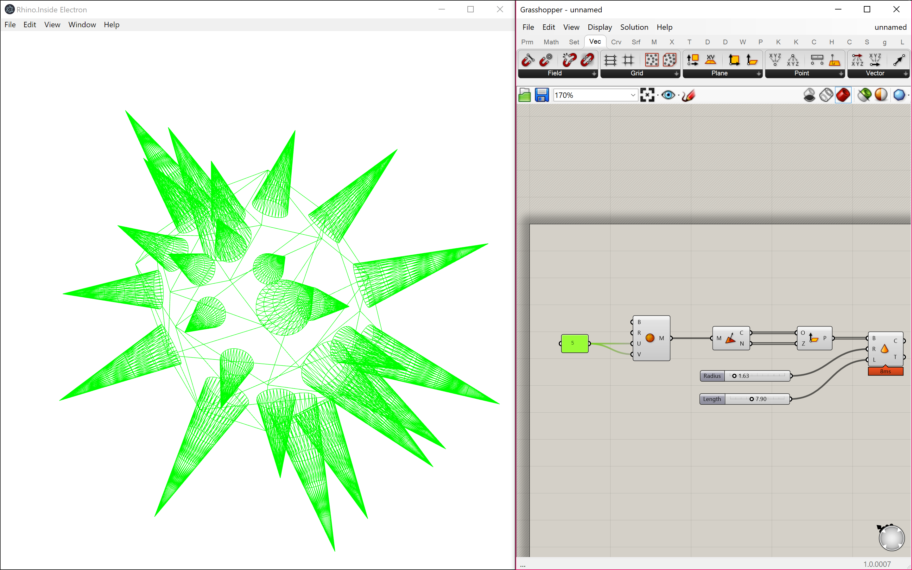

# Rhino Inside Node.js
### The Rhino Inside® technology allows Rhino and Grasshopper to be embedded within other products.

## Sample 4
This sample shows how to run Rhino from `Electron`.
This sample extends Sample 1, 2, and 3 by using Electron for UI. Geometry rendered with [three.js](https://threejs.org).
The sample has been tested on Windows 10, Rhino 7 WIP, and Node.js 8.11.12 (though should work on more recent versions of Node.js)

There are three projects in this sample:
- `InsideElectron` - Compiles to a .net framework class library with two classes and several methods. This class contains the code to start Rhino and Grasshopper, as well as a custom [`TaskScheduler`](https://docs.microsoft.com/en-us/dotnet/api/system.threading.tasks.taskscheduler?view=netframework-4.5.2).
- `TestInsideElectron` - A small project to test the TaskScheduler class to control Rhino.
- `InsideElectronApp` - The Electron app that provides a GUI and launches Rhino and Grasshopper from JavaScript.

### Dependencies
- [`Rhino 7 WIP`](https://www.rhino3d.com/download/rhino-for-windows/wip) (Required install)
- [`Node.js (8.11.2 or newer)`](https://nodejs.org/) (Required install)
- [`edge.js (^11.3.1)`](https://github.com/agracio/edge-js) (Referenced via npm)
- [`Electron.js`](https://electronjs.org/) (Referenced via npm)
- [`Json.NET`](https://www.newtonsoft.com/json) (Referenced via the NuGet package)
- [`rhino3dm.js`](https://www.rhino3d.com/rhino3dm) (Referenced via URL)
- [`three.js`](https://threejs.org/) (Referenced via URL)

### Running this sample
This assumes you've already installed Rhino 7 WIP and Node.js for Windows, and have cloned the Rhino.Inside repository.
1. Open the `InsideElectron.sln` in Visual Studio and build the solution. This builds the .dll which is referenced in the Electron app. Note: You might need to Clean dna Rebuild the InsideElectron.csproj to get NuGet to restore the Json.Net package.
2. Open a console from the `InsideElectronApp` directory.
3. Run `npm install` to install any dependencies.
4. Run `npm start` to run the sample. You should see the Electron window appear, followed by the Grasshopper editor.
5. In the Grasshopper editor, add a Mesh > Primitive > MeshSphere component to the Grasshopper Canvas. You should see someting like this:

As you continue to develop the definition, the rendered geometry will update to reflect what you have defined in the Grasshopper canvas:

